# Credit Risk Analysis 

## Analysis Overview 
Tasked with running our credit card data through a few different scenarios, we oversampled the data (RandomOverSampler & SMOTE used) and undersampled the data (ClusterCentroids used). We then moved to a combination of both (over and under sampling) with the use of SMOTEENN algorithm. For the final piece of our work, we wanted to predict risk using BalancedRandomForestClassifer and EasyEnsembleClassifer machine learning models used to reduce bias.  

## Results of Analysis

### Review of the Balanced Accuracy, Precision, and Recall Scores for each machine learning model used. 
As seen below the precision of each machine learning model was the same for each, so we move away from focusing on those numbers. Focusing on the Balanced Accuracy and the Sensitivity (recall) when reviewing the below outcome, we see that the EasyEnsembleClassifer outputs the most satisfying numbers with 93 for Balanced Accuracy and average of 94 for High-risk/Low-risk on the recall score. 

- RandomOverSampler

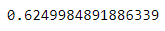

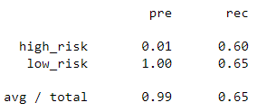

- SMOTE

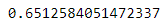

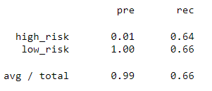

- ClusterCentroids

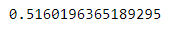

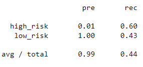

- SMOTEENN

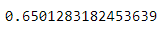

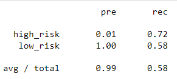

- BalancedRandomForestClassifer

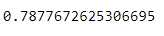

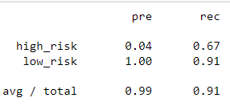

- EasyEnsembleClassifer

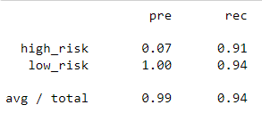

## Summary

For 3 of the 6 models used (RandomOverSampler, SMOTE, & SMOTEEN) we saw very similar scores. ClusterCentroids gave us the lowest scores of the bunch, and though BalancedRandomForestClassifer and EasyEnsembleClassifer had very close recall scores (91 and 94) the latter had a much higher accuracy score making it the select model to use.

