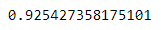

# Credit_Risk_Analysis

## Analysis Overview 
Tasked with running our credit card data through a few different sencarios, we oversampled the data (RandomOverSampler & SMOTE used) and undersampled the data (ClusterCentroids used). We then moved to a combination of both (over and under sampling) with the use of SMOTEENN alogrithm. For the final piece of the our work we wanted to predict risk using BalancedRandomForestClassifer and EasyEnsembleClassifer machine learning models used to reduce bias.  

## Results of Analysis

### Reveiw of the Balanced Accuracy, Precision, and Recall Scores for each manchine learning model used. 
- RandomOverSampler

- SMOTE

- ClusterCentroids

- SMOTEENN

- BalancedRandomForestClassifer

- EasyEnsembleClassifer

